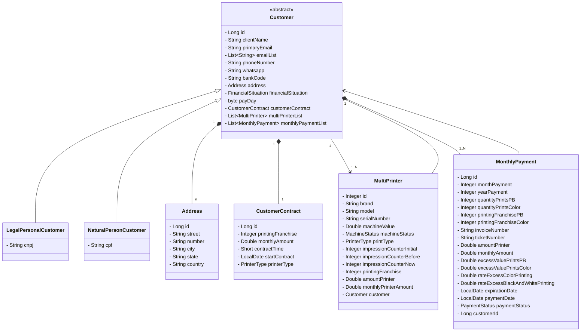

# Projeto COPY IMAGEM

## Objetivo do Projeto:

O objetivo principal do Projeto COPY IMAGEM é solucionar os desafios enfrentados no controle de
informações nas locações de impressoras pela empresa Copyimagem, visando uma gestão mais eficaz e transparente.
Iremos desenvolver e implementar uma APIRest para o backend com uma arquitetura de software robusta e escalável para a
aplicação CopyImagem. Faremos uso de
tecnologias avançadas como Java, Spring Boot e PostgreSQL para garantir um sistema eficiente e seguro. O Docker e o
Docker Compose serão utilizados para containerização e orquestração dos serviços, facilitando o gerenciamento de
dependências e a consistência dos ambientes de desenvolvimento e produção. Além disso, adotaremos a
prática de Desenvolvimento Orientado a Testes (TDD) para garantir a qualidade do código e a robustez das funcionalidades
implementadas.
Nosso foco primário é garantir a eficiência, segurança e manutenibilidade do sistema, proporcionando uma experiência
excepcional aos usuários finais. Estamos concentrados especialmente na gestão de
clientes, máquinas, mensalidades e controle de chamados para manutenção das máquinas.

### 1. Visão Geral da Arquitetura

A arquitetura da aplicação seguirá a arquitetura baseada em Microserviço para facilitar a manutenção e escalabilidade.
Cada aplicação será dividida em duas camadas principais: CORE e INFRA.

#### 1. Camada CORE da aplicação:

- Responsável por implementar a lógica de negócios da aplicação.
- Utilizará o Spring Boot para criar serviços transacionais e MVC para lidar com as requisições HTTP.
- Autenticação e autorização serão gerenciadas pelo Spring Security, utilizando JWT para token de autenticação.
- A documentação da API será gerada automaticamente pelo Swagger/OpenAPI.

##### a. Camada de Negócios (usecases):

- Implementará a lógica de negócios da aplicação.
- Fará uso do Spring Boot para criar serviços transacionais.
- Fará Integração com o banco de dados PostgreSQL.

##### b. Camada de Modelo (domain):

- Esta camada será responsável por entidades de domínio e enumeradores.
- Representará as entidades do domínio usando anotações JPA.
- Onde ficarão os enumeradores.
- Lombok será utilizado para reduzir a verbosidade.

##### c. Camada de Exceções (exceptions):

- Ficará responsável pelo tratamento das exceções personalizadas da aplicação.

##### d. Camada DTO (representationDTO):

- Esta camada terá a responsabilidade de transferir os dados entre as camadas da aplicação, sobretudo quando são
  expostas para o externo.

#### 2. Camada INFRA da aplicação:

##### a. Camada de Configuração (config):

- Responsável por lidar com as configurações da aplicação.

##### b. Camada Adapter (adapter):

##### c. Camada de Controle (controllers):

- Será responsável por receber as entradas dos usuários, coordenar as ações necessárias e chamar os casos de uso (use
  cases) apropriados.

- Terá a responsabilidade de traduzir os dados entre os casos de uso da aplicação e os detalhes da implementação
  externa, com frameworks, bibliotecas, APIs ou sistemas.

##### c. Camada de Persistência (persistence):

- Utilizará JPA (Java Persistence API) para interagir com o banco de dados.
- Repositórios serão criados para realizar operações de persistências como: Create, Read, Update e Delete.

### 2. Deployment e Orquestração

A aplicação será containerizada usando Docker para garantir consistência entre os ambientes de desenvolvimento, teste e
produção. Utilizaremos Docker Compose para orquestrar os múltiplos containers dos microserviços, facilitando a
comunicação entre eles e permitindo o escalonamento conforme necessário.

Cada microserviço será definido em seu próprio Dockerfile, encapsulando todas as dependências e variáveis de ambiente
necessárias. O Docker Compose será configurado para gerenciar o ambiente de rede, volumes e outros aspectos de
configuração dos containers.

### 3. Diagramas:

## Diagrama de Classes:

- Diagrama de Sequência:

```mermaid
sequenceDiagram
    participant Controller
    participant Service
    participant Repository

    Controller ->> Service: Requisição HTTP GET /api/v1/customers/search-client?typeParam={type}&valueParam={value}
    alt Pesquisa por parâmetros
        Service ->> Repository: Chamada para buscar cliente por parâmetros
        Repository -->> Service: Dados recuperados
        Service -->> Controller: Resposta com dados
    else Requisição GET /api/v1/customers/search-client-all
        Service ->> Repository: Chamada para buscar todos os clientes
        Repository -->> Service: Dados recuperados
        Service -->> Controller: Resposta com lista de clientes
    end

    Controller ->> Service: Requisição HTTP GET /api/v1/customers/search-financial-situation?situation={situation}
    alt Pesquisa situação financeira
        Service ->> Repository: Chamada para buscar clientes pela situação financeira
        Repository -->> Service: Dados recuperados
        Service -->> Controller: Resposta com lista de clientes
    end

    Controller ->> Service: Requisição HTTP PATCH /api/v1/customers/{id}?attribute={attribute}&value={value}
    Service ->> Repository: Chamada para atualizar atributo do cliente
    Repository -->> Service: Confirmação de atualização
    Service -->> Controller: Resposta com resultado da atualização

Controller ->> Service: Requisição HTTP GET /api/v1/customers/pj/all
    Service ->> Repository: Chamada para buscar todos os clientes pessoa jurídica
    Repository -->> Service: Dados recuperados
    Service -->> Controller: Resposta com lista de clientes pessoa jurídica

    Controller ->> Service: Requisição HTTP GET /api/v1/customers/pj/{id}
    Service ->> Repository: Chamada para buscar cliente pessoa jurídica por ID
    Repository -->> Service: Dados recuperados
    Service -->> Controller: Resposta com cliente pessoa jurídica encontrado

    Controller ->> Service: Requisição HTTP POST /api/v1/customers/pj/save
    alt Salvar cliente pessoa jurídica
        Service ->> Repository: Chamada para salvar cliente pessoa jurídica
        alt Validações de dados
            Service -> Service: Verifica existência de CNPJ ou e-mail
            Service -> Repository: Salva endereço do cliente
            Service ->> Repository: Gera contrato de cliente se não existir
        end
        Repository -->> Service: Cliente pessoa jurídica salvo com sucesso
        Service -->> Controller: Resposta com status HTTP 201 e localização do novo recurso
    else Exceção de violação de integridade de dados
        Service -->> Controller: Resposta com erro HTTP 400 ou 409
    end

    Controller ->> Service: Requisição HTTP GET /api/v1/customers/pf/all
    Service ->> Repository: Chamada para buscar todos os clientes pessoa física
    Repository -->> Service: Dados recuperados
    Service -->> Controller: Resposta com lista de clientes pessoa física

    Controller ->> Service: Requisição HTTP GET /api/v1/customers/pf/{id}
    Service ->> Repository: Chamada para buscar cliente pessoa física por ID
    Repository -->> Service: Dados recuperados
    Service -->> Controller: Resposta com cliente pessoa física encontrado

    Controller ->> Service: Requisição HTTP POST /api/v1/customers/pf/save
    alt Salvar cliente pessoa física
        Service ->> Repository: Chamada para salvar cliente pessoa física
        alt Validações de dados
            Service -> Service: Verifica existência de CPF ou e-mail
            Service -> Repository: Salva endereço do cliente
            Service ->> Repository: Gera contrato de cliente se não existir
        end
        Repository -->> Service: Cliente pessoa física salvo com sucesso
        Service -->> Controller: Resposta com status HTTP 201 e localização do novo recurso
    else Exceção de violação de integridade de dados
        Service -->> Controller: Resposta com erro HTTP 400 ou 409
    end
    
    Controller ->> Service: Requisição HTTP GET /api/v1/multi-printer
    Service ->> Repository: Chamada para buscar todos os multi-printers
    Repository -->> Service: Dados recuperados
    Service -->> Controller: Resposta com lista de multi-printers

    Controller ->> Service: Requisição HTTP GET /api/v1/multi-printer/{id}
    Service ->> Repository: Chamada para buscar multi-printer por ID
    Repository -->> Service: Dados recuperados
    Service -->> Controller: Resposta com multi-printer encontrado

    Controller ->> Service: Requisição HTTP GET /api/v1/multi-printer/customer/{customerId}
    Service ->> Repository: Chamada para buscar multi-printers por ID de cliente
    Repository -->> Service: Dados recuperados
    Service -->> Controller: Resposta com lista de multi-printers encontrados

    Controller ->> Service: Requisição HTTP POST /api/v1/multi-printer/save
    Service ->> Repository: Chamada para salvar multi-printer
    Repository -->> Service: Multi-printer salvo com sucesso
    Service -->> Controller: Resposta com status HTTP 201 e localização do novo recurso

    Controller ->> Service: Requisição HTTP PATCH /api/v1/multi-printer/set-customer?id={id}&customerId={customerId}
    Service ->> Repository: Chamada para configurar cliente em um multi-printer
    Repository -->> Service: Multi-printer atualizado com cliente configurado
    Service -->> Controller: Resposta com multi-printer atualizado

    Controller ->> Service: Requisição HTTP PATCH /api/v1/multi-printer/unset-customer/{id}
    Service ->> Repository: Chamada para remover cliente de um multi-printer por ID
    Repository -->> Service: Multi-printer atualizado com cliente removido
    Service -->> Controller: Resposta com status HTTP 204 (sem conteúdo)

    Controller ->> Service: Requisição HTTP PATCH /api/v1/multi-printer/status?id={id}&status={status}
    Service ->> Repository: Chamada para atualizar status de um multi-printer por ID
    Repository -->> Service: Status do multi-printer atualizado
    Service -->> Controller: Resposta com multi-printer atualizado

    Controller ->> Service: Requisição HTTP PATCH /api/v1/multi-printer/impression-counter?id={id}&counter={counter}&attribute={attribute}
    Service ->> Repository: Chamada para atualizar contador de impressões de um multi-printer por ID
    Repository -->> Service: Contador de impressões do multi-printer atualizado
    Service -->> Controller: Resposta com multi-printer atualizado

    Controller ->> Service: Requisição HTTP DELETE /api/v1/multi-printer/{id}
    Service ->> Repository: Chamada para deletar multi-printer por ID
    Repository -->> Service: Multi-printer deletado com sucesso
    Service -->> Controller: Resposta com status HTTP 204 (sem conteúdo)
```

### 4. Tecnologias Utilizadas:

- **Java e Spring Boot**:
    - Versão do Java: 17
    - Versão do Spring Boot: 3.2.7

- **Gerenciador de dependências**:
    - Maven

- **Docker e Docker Compose**:
    - Docker: Containerização dos microserviços para garantir consistência entre os ambientes de desenvolvimento, teste
      e produção.
    - Docker Compose: Orquestração dos contêineres para facilitar o gerenciamento e a configuração dos microserviços.

- **Banco de Dados**:
    - PostgreSQL: Utilizado para armazenamento persistente.

- **Persistência**:
    - Spring Data JPA: Facilita a implementação da camada de acesso a dados.
    - Hibernate: Fará as operações de acesso a dados e gerenciamento de transações e consultas SQL.

- **Segurança**:
    - Spring Security: Gerenciamento de autenticação e autorização.
    - JWT: Token de autenticação seguro.

- **Documentação**:
    - Swagger/OpenAPI: Documentação automática da API.

- **Lombok**:
    - Para redução de boilerplate code.

- **Relatórios**:
    - Apache POI: Para geração de relatórios em Excel.

### 5. Regras de Negócio

- **Sistema de Login**:
    - O login deverá ser feito com nickname e senha.
    - Após login feito, deverá ser disponibilizado um Token para acesso à API.
    - O login será administrado pelo Spring Security.

- **Controle de Clientes**:
    - Atributos para cliente: (listados)

- **Controle de Máquinas**:
    - Atributos para máquina: (listados)

- **Controle de Mensalidades**:
    - Deverá listar todos os clientes e máquinas.
    - Poderão ser editados os clientes e máquinas.
    - Não deverá possibilitar modificar valores de mensalidades num prazo maior de que 40 dias do seu lançamento.
    - Não devem ser deletadas nenhuma informação de clientes, de mensalidades e nem de máquinas.

### 6. Padrões de Codificação e Convenções:

- **Padrões de Commits e Versionamento**:
    - (detalhado na seção)
- Exemplo:
    - [ topico ] : "**descrição do commit**"
    -  [ addition ] : First commit

    - **Tópicos de Commit:**
        1. **addition / inclusion:** Usado especificamente para adicionar novos elementos ao código, como atributos,
           métodos, classes, etc.
        2. **feature:** Usado para adicionar uma nova funcionalidade ao código.
        3. **refactor:** Usado para fazer alterações no código para melhorar sua estrutura, legibilidade ou desempenho
           sem alterar seu comportamento externo.
        4. **enhancement:** Usado para adicionar melhorias ou otimizações ao código existente.
        5. **update:** Usado quando você está atualizando ou modificando partes existentes do código.
        6. **docs:** Usado para fazer alterações na documentação do código, como adicionar ou corrigir comentários,
           atualizar documentação de API, etc.
        7. **cleanup:** Usado para realizar tarefas de limpeza no código, como remover código morto, otimizar imports,
           etc.
        8. **bugfix:** Usado para corrigir um bug existente no código.
        9. **test:** Usado para adicionar, modificar ou corrigir testes de unidade, testes de integração, etc.
        10. **test refactor:** Usado para informar alterações no código dos testes.
        11. **build:** Usado para modificações nos arquivos de Build.

### 7. Arquitetura do Projeto Backend:

- **src**
    - main
        - java
            - core
                - domain
                    - entities
                        - Customer
                        - CustomerContract
                        - LegalPesonalCustomer
                        - NaturalPersonCustomer
                        - Address
                        - MonthlyPayment
                        - MultiPrinter
                    - enums
                        - FinancialSituation
                        - MachineStatus
                        - PaymentStatus
                        - PrinterType
                - dto
                    - CustomerResponseDTO
                    - LegalPersonalCustomerDTO
                    - MultiPrinterDTO
                    - NaturalPersonCustomrDTO
                    - UpdateCustometDTO
                - exceptions
                    - GlobalExceptionHandler
                    - DataIntegrityViolationException
                    - IllegalArgumentException
                    - NoSuchElementException
                    - StandardError
                - usecases
                    - interfaces
                        - ConvertObjectToObjectDTOService
                        - CustomerService
                        - LegalPersonalCustomerService
                        - MultiPrinterService
                        - NaturalPersonCustomerService
                    - impl
                        - CustomerServiceImpl
                        - LegalPersonalCustomerServiceImpl
                        - MultiPrinterServiceImpl
                        - NaturalPersonCustomerServiceImpl
            - infra
                - controllers
                    - CustomerController
                    - LegalPersonalController
                    - NaturalPersonController
                - adaptors
                    - apiexterna
                        - ApiExternaAdapter
                        - ApiExternaAdapterInterface
                    - emailapi
                        - MensageriaAdapter
                        - MensageriaAdapterInterface
                - config
                    - ModelMapperConfig
                    - SecurityConfig
                    - security
                        - JwtTokenProvider.java // Provedor JWT
                - persistence
                    - repositories
                        - AddressRepository
                        - CustomerContractRepository
                        - CustomerRepository
                        - LegalPersonalCustomerRepository
                        - MultiPrinterRepository
                        - NaturalPersonCustomerRepository

- **Gerenciamento de Dependências**:
    - Utilizar uma ferramenta de gerenciamento de dependências, como Maven ou Gradle.
